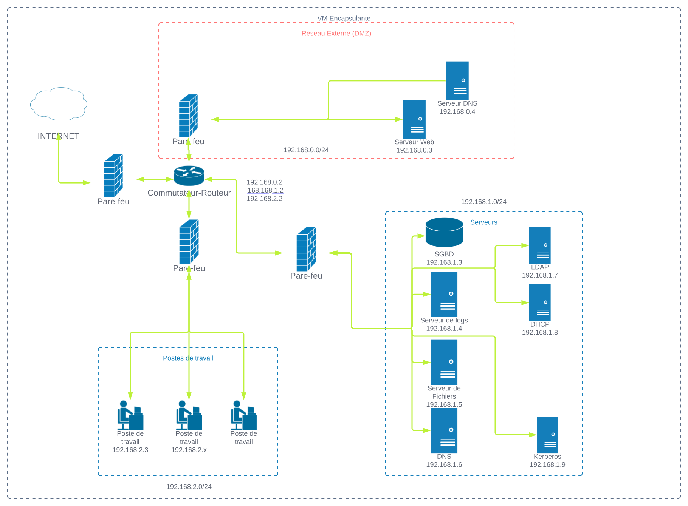

---
hide:
  - navigation
---
# Bienvenue sur la documentation de Cipher

## Introduction

Cipher est un projet de mise en place d'une infrastructure réseau via l'application de scripts bash.
Il permet de mettre en place un réseau local avec des machines virtuelles, des serveurs, des clients, et une DMZ, le tout de manière automatique et sécurisée.

Vous êtes arrivés sur nos pages de documentation. Vous trouverez ici toutes les informations nécessaires pour mettre en place l'infrastructure de Cipher.

## Schéma de l'infrastructure de Cipher

